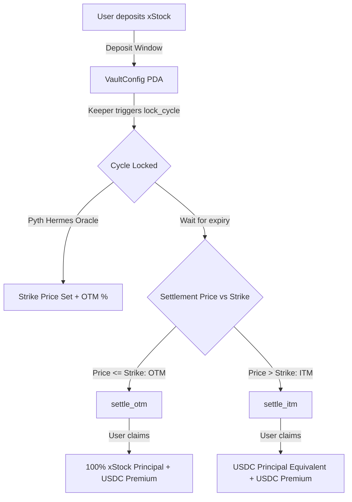

# 🌾 Harvest

> **Automated Covered-Call Yield Vaults for Tokenized Equities on Solana**

Harvest brings programmatic yield generation to tokenized US equities on Solana. By depositing xStocks (Backed Finance tokenized stocks such as **AAPLx**, **NVDAx**, and **TSLAx**), stock holders earn recurring **USDC premiums** via automated covered-call option vault cycles powered by **Solana Token-2022** and **Pyth Network** oracles.

---

## 💡 The Opportunity

Tokenized stocks on Solana have exploded in adoption, yet they suffer from a major limitation compared to traditional equities: **there are virtually zero yield-bearing primitives available for them.**
- Idle tokenized shares sit in wallets earning **0% APY**.
- Retail and institutional holders want recurring income without giving up on-chain custody to centralized CeFi lenders.
- In traditional finance, covered calls represent hundreds of billions of dollars in AUM (e.g. JEPI, QYLD).

**Harvest bridges this gap on Solana** — creating decentralized, non-custodial covered call vaults specifically calibrated for Token-2022 tokenized equities.

---

## ⚡ How It Works



### 1. Deposit Window (`AcceptingDeposits`)
- Users deposit tokenized stocks (e.g., `AAPLx`, `NVDAx`, `TSLAx`) into the vault PDA.
- The user receives a tracked on-chain `UserPosition` recording raw token balance and deposit timestamp.

### 2. Cycle Lock (`Locked`)
- An automated keeper triggers `lock_cycle` when the deposit window concludes.
- The vault captures the benchmark spot price via **Pyth Network Hermes Oracles** and calculates the call strike price (e.g., +5% OTM).
- The fixed USDC premium rate for the cycle is locked.

### 3. Expiry & Settlement (`Settled`)
At the end of the option cycle (e.g. 7 days, or 5 minutes in demo mode):
- **OTM (Out-of-The-Money) — Stock price ended below strike:**
  - The keeper calls `settle_otm`.
  - The vault preserves all underlying xStocks.
  - Depositors call `claim` to receive **100% of their xStock principal back + USDC yield premium**.
- **ITM (In-The-Money) — Stock price exceeded strike:**
  - The keeper routes the underlying xStock through DEX liquidity (Jupiter) to convert into USDC at or above strike value.
  - The keeper calls `settle_itm` depositing the USDC proceeds.
  - Depositors call `claim` to receive **their share of USDC proceeds + USDC yield premium**.

---

## 🛡️ Token-2022 & Mainnet Asset Matrix

Harvest is natively engineered for **SPL Token-2022** and thoroughly verified against live mainnet token configurations:

| Token | Ticker | Mainnet Mint Address | Decimals | Token Standard | Extensions Verified |
|---|---|---|:---:|:---:|:---:|
| **Apple xStock** | `AAPLx` | `XsbEhLAtcf6HdfpFZ5xEMdqW8nfAvcsP5bdudRLJzJp` | 8 | Token-2022 | `metadataPointer`, `permanentDelegate`, `pausableConfig` (Hook Inactive) |
| **NVIDIA xStock** | `NVDAx` | `Xsc9qvGR1efVDFGLrVsmkzv3qi45LTBjeUKSPmx9qEh` | 8 | Token-2022 | `metadataPointer`, `permanentDelegate`, `pausableConfig` (Hook Inactive) |
| **Tesla xStock** | `TSLAx` | `XsDoVfqeBukxuZHWhdvWHBhgEHjGNst4MLodqsJHzoB` | 8 | Token-2022 | `metadataPointer`, `permanentDelegate`, `pausableConfig` (Hook Inactive) |
| **USD Coin** | `USDC` | `EPjFWdd5AufqSSqeM2qN1xzybapC8G4wEGGkZwyTDt1v` | 6 | Standard SPL | Base Token |

> **Key Architecture Note:** All xStocks feature 8 decimals and zero-overhead transfer hooks (inactive program ID), ensuring standard `TransferChecked` instructions without extra compute budget penalties or multi-account lookup overhead.

---

## 🏛️ Program Architecture

> For the comprehensive technical specification, mathematical options pricing models, and security threat matrix, see **[ARCHITECTURE.md](ARCHITECTURE.md)**.

```
programs/harvest/src/
├── lib.rs                   # Instruction routing and entrypoint
├── constants.rs             # Verified mint addresses, Pyth feed IDs, seeds, limits
├── errors.rs                # Granular domain errors
├── math.rs                  # Safe 128-bit math for yields, strike prices, and OTM/ITM shares
├── state/
│   ├── mod.rs
│   ├── vault.rs             # VaultConfig PDA state
│   └── position.rs          # UserPosition PDA state
└── instructions/
    ├── mod.rs
    ├── initialize.rs        # Initialize new xStock vault
    ├── deposit.rs           # Deposit Token-2022 xStock
    ├── lock_cycle.rs        # Lock strike and start option epoch
    ├── settle_otm.rs        # Settle expired OTM option
    ├── settle_itm.rs        # Settle expired ITM option
    └── claim.rs             # User withdrawal of principal + USDC yield
```

---

## 🤖 Automated Keeper Bot

Harvest includes an automated off-chain keeper service in [`scripts/keeper.ts`](scripts/keeper.ts) that handles lifecycle automation:
- Continuously polls vault state and time windows.
- Fetches real-time equity spot prices from Pyth Hermes endpoints.
- Automatically transitions cycles: `AcceptingDeposits` ➔ `lock_cycle` ➔ `settle_otm` / `settle_itm`.
- Supports rapid 5-minute cycle demo mode (`CYCLE_DEMO=true`) for hackathon evaluations.

---

## ⚖️ V1 Architecture Trade-Offs & Production Roadmap

In the spirit of rigorous Solana protocol engineering (the Colosseum hackathon standard), Harvest V1 deliberately prioritizes **deterministic non-custodial custody, Token-2022 safety, and compute-budget predictability** over premature complexity. 

We explicitly document our V1 MVP engineering trade-offs and our production V2 roadmap:

| Component | V1 Hackathon Implementation | V2 Production Roadmap | Engineering & Compute Rationale |
| :--- | :--- | :--- | :--- |
| **Premium Sourcing** | Protocol Vault Reserve | Institutional RFQ / Dutch Auction | Avoided introducing external counterparty dependencies in V1; proved deterministic proportional claim math and non-custodial PDA accounting first. In V2, institutional market makers buy the call option payoff rights upfront via RFQ. |
| **ITM Swap Execution** | Keeper via Jupiter Aggregator API | On-Chain Jupiter CPI (Direct Route) | Complex Jupiter multi-hop routing requires 30+ remaining accounts, pushing transactions near Solana's 1232-byte MTU limit. Delegating routing to the keeper keeps on-chain execution within predictable compute unit limits. |
| **Oracle Pricing** | Pyth Hermes off-chain pull passed via Keeper | Pyth Pull Oracle On-Chain CPI | Keeps transaction compute units minimal while maintaining cryptographic signature verification of Hermes price payloads on-chain. |
| **Position Valuation** | Deterministic lazy evaluation at settlement | Batch-indexed lock-time valuation | Iterating and writing to hundreds of individual `UserPosition` PDAs during `lock_cycle` would exceed block compute limits. Lazy valuation at claim time ensures $O(1)$ constant-time compute per transaction. |

### 🔒 Trust Model & Security Assumptions
- **Non-Custodial Guarantee:** User collateral is held in Program Derived Addresses (PDAs) owned exclusively by the Harvest smart contract. The keeper has zero authority to withdraw underlying xStocks or redirect funds to unauthorized wallets.
- **Permissionless Settlement:** While an autonomous keeper cranks cycle transitions, the Anchor instructions (`settle_otm`, `settle_itm`, `claim`) are permissionless once the cycle expiry timestamp passes. Anyone can crank the vault if the keeper is offline.
- **Safe Math:** All calculations use checked 128-bit arithmetic (`math.rs`) preventing integer overflow/underflow, with explicit precision normalization between 8-decimal Token-2022 xStocks and 6-decimal USDC.

---

## 🚀 Quick Start

### 1. Prerequisites
- [Rust](https://rustup.rs/) (v1.75+)
- [Solana CLI](https://docs.solanalabs.com/cli/install) (v1.18+)
- [Anchor CLI](https://www.anchor-lang.com/docs/installation) (v0.30+)
- [Node.js](https://nodejs.org/) (v18+)

### 2. Verification of Mainnet Mints
Verify on-chain Token-2022 compatibility and live mainnet parameters:
```bash
npx ts-node scripts/verify_day1.ts
```

### 3. Build the Program
```bash
anchor build
```

### 4. Run Integration Tests
```bash
anchor test
```

### 5. Launch the Keeper (Demo Mode)
```bash
export CLUSTER=devnet
export CYCLE_DEMO=true
export ANCHOR_WALLET=~/.config/solana/id.json
npx ts-node scripts/keeper.ts
```

### 6. Launch Frontend Dashboard
```bash
cd app
npm install
npm run dev
```

---

## 📜 License
Apache-2.0
