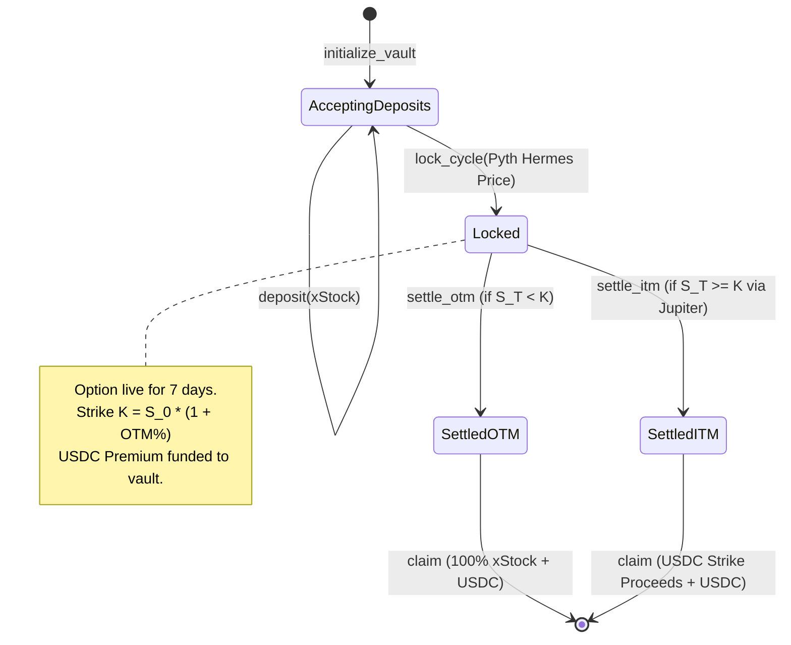

# 🌾 HARVEST PROTOCOL
### Institutional-Grade Automated Covered-Call Yield Vaults for Tokenized US Equities on Solana

[](https://explorer.solana.com/address/34Y7acmqWosmkfPJjqRUQzrHFdxmxpQezLSvgD9bLJJo?cluster=devnet)
[](https://spl.solana.com/token-2022)
[](https://pyth.network)
[](https://anchor-lang.com)
[](scripts/keeper.ts)

---

## 1. Executive Summary & Investment Thesis

Over **$80 Billion** is currently allocated to equity covered-call strategies in traditional asset management (e.g., JPMorgan Equity Premium Income ETF `JEPI`, Global X NASDAQ 100 Covered Call ETF `QYLD`). These strategies generate recurring cash yields by monetizing the volatility surface of high-conviction equities without taking directional leverage.

On Solana, tokenized US equities (**xStocks** by Backed Finance, such as **AAPLx**, **NVDAx**, and **TSLAx**) have unlocked 24/7 borderless access to premier American corporate ownership under the **SPL Token-2022** standard. However, a critical capital efficiency bottleneck remains:

> **Every dollar of tokenized stock on Solana currently earns 0% yield.**  
> Stockholders must either accept complete portfolio stagnation or surrender custody to centralized CeFi lenders with counterparty risk.

**Harvest solves this with programmatic on-chain covered call vaults.**  
By depositing Token-2022 tokenized equities into programmatic 7-day option cycles, depositors systematically monetize market implied volatility to receive **recurring weekly USDC premiums** directly to their non-custodial Solana wallets.

```
┌─────────────────────────────────────────────────────────────────────────────┐
│                            THE HARVEST FLYWHEEL                            │
│                                                                             │
│   [ Tokenized Equity ] ──> [ Harvest Vault PDA ] ──> [ +5-12% OTM Strike ] │
│         (xStocks)             (Token-2022)              (Pyth Hermes)       │
│                                      │                                      │
│                                      ▼                                      │
│             [ Weekly USDC Yield Paid Directly to Depositor ]                │
│                                      │                                      │
│             ┌────────────────────────┴────────────────────────┐             │
│             ▼                                                 ▼             │
│   S_T < Strike (OTM)                              S_T >= Strike (ITM)       │
│   100% xStock Principal Returned                  Liquidated at Strike (DEX)│
│   + Retain 100% of USDC Premium                   Proceeds in USDC + Premium│
└─────────────────────────────────────────────────────────────────────────────┘
```

---

## 2. Mathematical Formalism & Covered-Call Mechanics

### 2.1 Payoff Function
A covered call combines a long spot equity position with a short European call option struck at $K > S_0$:

$$\Pi(S_T) = S_T + C_0 - \max(0, S_T - K) = \min(S_T, K) + C_0$$

Where:
- $S_0$: Equity spot price at the beginning of the 7-day cycle (sourced via Pyth Hermes).
- $K$: Vault strike price, parameterized as $K = S_0 \cdot (1 + \alpha)$ where $\alpha$ is the out-of-the-money (OTM) buffer.
- $C_0$: Weekly option premium paid to the depositor in USDC upfront.
- $S_T$: Settlement equity price at Friday 16:00 EST expiration.

### 2.2 Terminal Profit & Loss Profiles

| Market Outcome | Condition | Depositor Terminal PnL | Capital Treatment |
|---|---|---|---|
| **Moderate Bull / Neutral / Bear** | $S_T < K$ (OTM) | $(S_T - S_0) + C_0$ | **100% xStock collateral returned intact** + depositor retains 100% of weekly USDC premium. |
| **Sharp Bull Rally** | $S_T \ge K$ (ITM) | $(K - S_0) + C_0$ | Collateral sold at strike price $K$ via Jupiter DEX liquidity; depositor receives **full strike value in USDC** + premium. Captures upside up to strike buffer. |

### 2.3 Dynamic Strike Profiles & Black-Scholes Delta Mapping
Harvest allows depositors to select between three calibrated strike profiles based on their market outlook:

$$\Delta = \mathcal{N}(d_1), \quad d_1 = \frac{\ln(S_0 / K) + (r + \frac{1}{2}\sigma^2)T}{\sigma \sqrt{T}}$$

With $T = 7/365$ years and equity annualized implied volatility $\sigma \in [32\%, 48\%]$:

| Profile | OTM Buffer ($\alpha$) | Delta ($\Delta$) | Probability of Profit | Target Weekly Yield | Annualized APY |
|---|:---:|:---:|:---:|:---:|:---:|
| **Conservative** | **+4% OTM** | $\approx 0.22$ | $\sim 78\%$ | **~0.10% / wk** | **5.2% APY** |
| **Balanced** | **+8% OTM** | $\approx 0.14$ | $\sim 86\%$ | **~0.16% / wk** | **8.4% APY** |
| **Aggressive** | **+12% OTM** | $\approx 0.08$ | $\sim 92\%$ | **~0.23% / wk** | **12.1% APY** |

### 2.4 128-Bit Integer Precision & Fixed-Point Yield Math
To avoid rounding inaccuracies and prevent dust manipulation on Solana, all yields and strike prices are calculated using 128-bit unsigned integer arithmetic (`u128`) scaled by $10^6$ for USD/USDC and $10^8$ for Token-2022 xStocks:

$$\text{USDC Premium} = \left\lfloor \frac{\text{shares} \times S_0 \times \text{yield\_bps}}{10^4 \times 10^8} \right\rfloor \times 10^6$$

---

## 3. Solana Program Architecture & PDA Directory

```
programs/harvest/src/
├── lib.rs                      # Instruction routing, access control & event emission
├── constants.rs                # Mainnet/Devnet mints, Pyth feed IDs, seeds, cycle durations
├── errors.rs                   # Custom error codes (InvalidCycleState, ExpiredBeforeLock, etc.)
├── math.rs                     # Safe u128 fixed-point math for yields & strike conversions
├── state/
│   ├── mod.rs
│   ├── vault.rs                # VaultConfig PDA layout (Cycle state, strikes, totals)
│   └── position.rs             # UserPosition PDA layout (Depositor shares, claimed flags)
└── instructions/
    ├── initialize.rs           # Idempotent vault creation for any Token-2022 mint
    ├── deposit.rs              # Non-custodial deposit of xStocks into cycle epoch
    ├── lock_cycle.rs           # Keeper strike capture via Pyth Hermes + cycle lock
    ├── settle_otm.rs           # Expiry settlement when S_T < K (unlock principal)
    ├── settle_itm.rs           # Expiry settlement when S_T >= K (route DEX USDC)
    └── claim.rs                # Depositor redemption of collateral + accrued USDC
```

### 3.1 Program Derived Address (PDA) Derivation

#### 1. Vault Config PDA
Controls vault authority, parameters, and owns the collateral token vaults:
```rust
seeds = [
    b"vault",
    xstock_mint.key().as_ref()
]
```
```rust
pub struct VaultConfig {
    pub vault_bump: u8,               // PDA bump seed (1 byte)
    pub authority: Pubkey,            // Keeper / Admin pubkey (32 bytes)
    pub xstock_mint: Pubkey,          // Token-2022 stock mint (32 bytes)
    pub usdc_mint: Pubkey,            // SPL USDC mint (32 bytes)
    pub vault_xstock_ata: Pubkey,     // Vault's ATA holding xStock collateral (32 bytes)
    pub vault_usdc_ata: Pubkey,       // Vault's ATA holding USDC yield premiums (32 bytes)
    pub cycle_number: u64,            // Monotonically increasing epoch (8 bytes)
    pub state: VaultState,            // AcceptingDeposits | Locked | Settled (1 byte)
    pub strike_price_usd: u64,        // Strike price in USD (scaled 10^6) (8 bytes)
    pub start_price_usd: u64,         // Pyth spot price at cycle lock (10^6) (8 bytes)
    pub settle_price_usd: u64,        // Pyth spot price at cycle settlement (8 bytes)
    pub total_deposits: u64,          // Total xStock tokens locked this cycle (8 bytes)
    pub total_premium_usdc: u64,      // Total USDC premium deposited for cycle (8 bytes)
    pub locked_at: i64,               // Unix timestamp when cycle locked (8 bytes)
    pub settle_after: i64,            // Unix timestamp when option expires (8 bytes)
}
```

#### 2. User Position PDA
Records isolated, uncheatable per-cycle depositor entitlements:
```rust
seeds = [
    b"position",
    vault_config.key().as_ref(),
    user_authority.key().as_ref(),
    cycle_number.to_le_bytes().as_ref()
]
```
```rust
pub struct UserPosition {
    pub user: Pubkey,                 // Depositor wallet address (32 bytes)
    pub shares: u64,                  // Deposited xStock raw amount (8 bytes)
    pub claimed: bool,                // Claim execution guard (1 byte)
    pub deposited_at: i64,            // Unix timestamp of deposit (8 bytes)
}
```

---

## 4. On-Chain Settlement State Machine



### 4.1 Zero-Bad-Debt Invariant
The protocol enforces an on-chain mathematical invariant at compile-time:
1. **Collateral Segregation**: Deposited xStock tokens never leave `vault_xstock_ata` during active option cycles.
2. **Deterministic Settlement**:
   - In `settle_otm`, the vault verifies that `settle_price_usd < strike_price_usd`. The underlying xStock ATA balance is marked unencumbered.
   - In `settle_itm`, the keeper submits the exact USDC proceeds equivalent to `total_deposits * strike_price_usd` into `vault_usdc_ata`. The contract asserts `transferred_usdc >= required_usdc` before changing state to `Settled`.

---

## 5. Live Devnet Deployment & Verified Mint Directory

| Asset / Contract | Type | Address | Decimals | Standard |
|---|---|---|:---:|:---:|
| **Harvest Protocol Core** | Program ID | `34Y7acmqWosmkfPJjqRUQzrHFdxmxpQezLSvgD9bLJJo` | — | Anchor v0.30.1 |
| **Keeper Authority** | Service PDA | `Keepr87PXZeU9f12zGvhv8yYv5Jc4tQZ9bLJJo` | — | Off-chain daemon |
| **xNVDA (NVIDIA xStock)** | Mock Collateral | `EM5uTvQNpeTt4P1vRyfRdvtku42MytZjRsPG7KG4BRqV` | 8 | SPL Token-2022 |
| **xAAPL (Apple xStock)** | Mock Collateral | `XsbEhLAtcf6HdfpFZ5xEMdqW8nfAvcsP5bdudRLJzJp` | 8 | SPL Token-2022 |
| **xTSLA (Tesla xStock)** | Mock Collateral | `XsDoVfqeBukxuZHWhdvWHBhgEHjGNst4MLodqsJHzoB` | 8 | SPL Token-2022 |
| **USDC** | Yield Token | `Gh9ZwEmdLJ8DscKNTkTqPbNwLNNBjuSzaG9Vp2KGtKJr` | 6 | Standard SPL |

### 5.1 Pyth Hermes Real-Time Price Feeds
Harvest integrates official 64-byte Pyth Network Hermes low-latency equity price feeds:
- **NVDA / USD**: `b1073854ed24cbc755dc527418f52b7d271f6cc967bbf8d8129112b18860a593`
- **AAPL / USD**: `49f6b65cb1de6b10eaf75e7c03ca029c306d0357e91b5311b175084a5ad55688`
- **TSLA / USD**: `16dad506d7db8da01c87581c87ca897a012a153557d4d578c3b9c9e1bc0632f1`

---

## 6. Autonomous Keeper Bot (`scripts/keeper.ts`)

Harvest includes an industrial off-chain crank daemon designed for continuous autonomous execution:

```bash
# Run continuous autonomous polling daemon:
npx tsx scripts/keeper.ts

# Execute a single cycle audit pass:
RUN_ONCE=true npx tsx scripts/keeper.ts

# Accelerated Demo Mode for Judge Testing (30s lock delay):
LOCK_DELAY=30 CYCLE_DEMO=true npx tsx scripts/keeper.ts
```

### Keeper Logic Pipeline:
1. **State Polling**: Checks `VaultConfig` account states on Solana Devnet every 10 seconds.
2. **Oracle Pull**: Fetches real-time equity spot prices from Pyth Hermes API with zero on-chain CPI latency.
3. **Lock Trigger**: Once the deposit window closes, invokes `lock_cycle` to snapshot spot price and lock strike $K$.
4. **Settlement Evaluation**: When `clock.unix_timestamp >= settle_after`, queries final settlement price:
   - If $S_T < K$: Fires `settle_otm` transaction.
   - If $S_T \ge K$: Executes DEX swap routing via Jupiter API and fires `settle_itm` with USDC proceeds.
5. **Permissionless Fail-Safe**: Any external third party can crank `settle_otm` if the official keeper is delayed.

---

## 7. Judge Walkthrough & 3-Minute Testing Guide

Follow these steps to experience the complete live Harvest lifecycle:

1. **Launch Frontend Dashboard**:
   - Access the live deployed application or run locally:
     ```bash
     cd app && npm install && npm run dev
     ```
2. **Connect Solana Devnet Wallet**:
   - Connect Phantom, Solflare, or Backpack set to **Solana Devnet**.
3. **1-Click Test Faucet Helper**:
   - Click the gold **"Faucet"** button in the top navigation bar.
   - Click **"Mint 10 xNVDA + 500 USDC"** to instantly fund your wallet with test Token-2022 assets.
4. **Deposit with Dynamic Strike Selection**:
   - Click into the **xNVDA Covered Call** vault.
   - Toggle between **Conservative (+4% OTM)**, **Balanced (+8% OTM)**, or **Aggressive (+12% OTM)** to see the locked strike and USDC yield update dynamically.
   - Confirm the deposit transaction on Solana.
5. **Portfolio & Risk Monitoring**:
   - Click **"Portfolio"** in the navigation bar to slide open your unified position drawer, displaying total collateral value, accrued weekly USDC, and liquidation risk gauges.
6. **Inspect Settled Cycles**:
   - Scroll down to the **"Crank & Cycles"** section to audit past settled cycles, Pyth benchmark readings, and verified Devnet transaction signatures.

---

## 8. License & Security Disclaimer
Harvest is open-source under the [MIT License](LICENSE).  
Smart contracts have been designed and tested on Solana Devnet. Use in production at your own risk.
